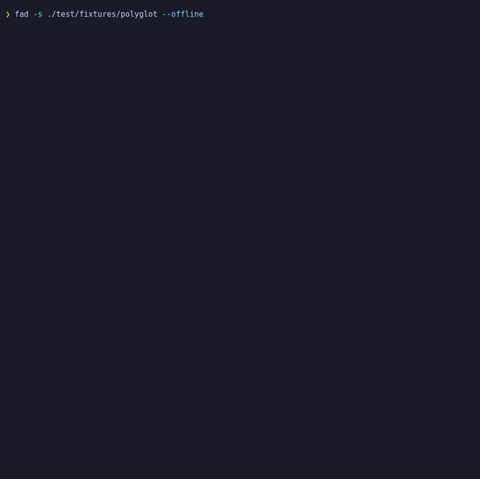
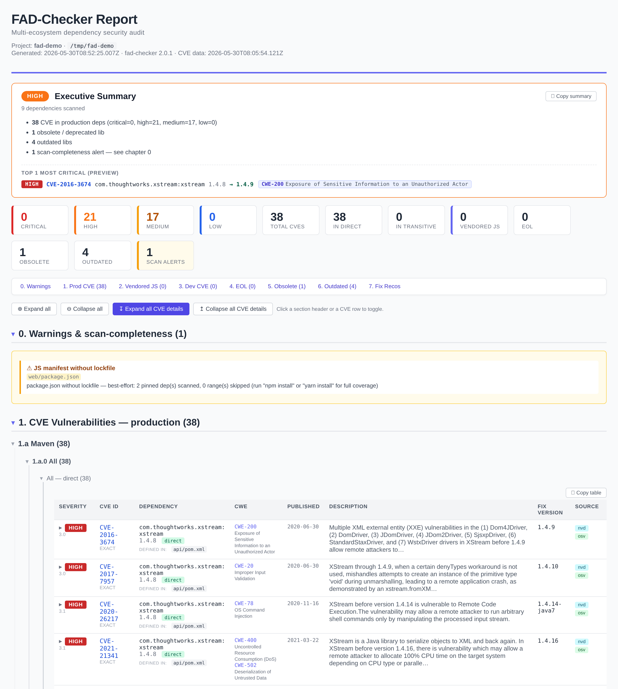

# fad-checker

[](https://www.npmjs.com/package/fad-checker)
[](https://www.npmjs.com/package/fad-checker)
[](https://github.com/9pings/fad-checker/blob/main/package.json)
[](https://nodejs.org)

> **F**abulous **A**utonomous **D**ependency **C**hecker<br>
> AKA **F**uckin' **A**utonomous **D**ependency **C**hecker<br>

`fad-checker` audits **Maven · Gradle · npm · Yarn · pnpm · Composer · PyPI · NuGet · Go · Ruby**, vendored JavaScript and committed native binaries in any source tree — multi-module, monorepo, polyglot — and produces a self-contained **HTML + Word report** (CVE prioritised by EPSS + CISA KEV, EOL, obsolete, outdated, licenses) plus **CycloneDX SBOM / CSAF VEX / SARIF / JSON** exports. **No build tools, no Docker, no network needed** — it reads lockfiles and manifests straight off disk.

🌐 **[Project site & docs →](https://9pings.github.io/fad-checker/)**

> [!WARNING]
> **Young project — expect rough edges.** fad-checker is new and under active development, so it may still contain bugs (including false positives and false negatives). Treat its output as a strong first pass, **double-check anything critical**, and please [report issues](https://github.com/9pings/fad-checker/issues) — they get fixed fast.

<p align="center"></p>

## Features

- **10 ecosystems in one pass** — Maven, **Gradle**, npm/Yarn/pnpm, Composer (PHP), PyPI, NuGet, Go, Ruby; plus **vendored JS** (retire.js), committed **native binaries** (`.dll`/`.exe`/`.so`/`.dylib`, identified by checksum via deps.dev + CIRCL) and **embedded JARs** (fat-jars/war/ear, unzipped in-memory).
- **No build tools** — reads `pom.xml`, `build.gradle(.kts)`/`gradle.lockfile`/`libs.versions.toml`, `package-lock`/`yarn.lock`/`pnpm-lock`, `composer.lock`, `poetry`/`Pipfile`/`uv`/`pdm` locks, `packages.lock.json`/`*.csproj`, `go.mod`, `Gemfile.lock` directly. No `mvn`/`gradle`/`npm install`/`pip`/`dotnet restore`/`go build`/`bundle`, no `node_modules/`. → [how it stays build-free](docs/COMPARISON.md#how-its-autonomous-no-build-tools)
- **CVE, merged & prioritised** — CVEProject + OSV.dev + NVD, CPE/version cross-checked to cut false positives, ranked **CISA KEV → EPSS → CVSS**.
- **Per-module Maven version mediation** — recovers vulnerable transitive versions that a global `<dependencyManagement>` pin hides in another module (lifted Snyk-corroborated coverage **156 → 181** on a real 25-module reactor, finding CVEs a single Snyk scan missed).
- **Air-gapped** — **zero network under `--offline`** (regression-tested), offline Maven transitive resolution, and `--osv-db` for cache-independent offline OSV recall. → [Air-gapped](#air-gapped-audits)
- **Supply-chain risk** — known-**malicious** advisories (`MAL-`, always block the CI gate) + suspected **typosquats** (`--typosquat`).
- **Lifecycle** — EOL (endoflife.date), obsolete/deprecated, outdated — across every ecosystem.
- **Licenses** *(opt-in `--licenses`)* — SPDX-normalised, copyleft/proprietary flagged.
- **Audit-grade & reproducible** — every report carries a **provenance manifest** (data-source freshness + run config) and a **Methodology, data sources & limitations** chapter; artifacts ship a **`SHA256SUMS`** integrity manifest (`sha256sum -c`); **differential audits** diff against a prior run (`--baseline`, or `fad diff a.json b.json`) and CI can gate on *new* findings (`--fail-on-new`).
- **Outputs & CI** — HTML + Word `.doc`, CycloneDX 1.6 SBOM, CSAF 2.0 VEX, SARIF 2.1.0, JSON; gate with `--fail-on` / `--fail-on-new`, triage with `--ignore`/`--vex`. Private registries for Maven, npm, PyPI, Ruby, Go, **NuGet** and **Composer**.

📖 **[Usage & all flags](docs/USAGE.md)** · **[Architecture](docs/ARCHITECTURE.md)** · **[Comparison vs other tools](docs/COMPARISON.md)** · **[Data sources](docs/DATA-SOURCES.md)**

## Quick start

```bash
npm install -g fad-checker
fad-checker -s ./my-project          # → ./fad-checker-report/cve-report.html
```

A free [NVD API key](https://nvd.nist.gov/developers/request-an-api-key) (instant) gives 10× faster enrichment: `fad-checker --set-nvd-key YOUR_KEY`. A few common runs — full list via `fad-checker --help` or [docs/USAGE.md](docs/USAGE.md):

```bash
fad-checker -s ./proj -e "^com\.acme\."                        # exclude private libs (coord regex)
fad-checker -s ./proj -t ../clean -e "^com\.acme\." --snyk     # cleaned POM tree + merge Snyk
fad-checker -s ./proj --offline                                # fully offline (zero network)
fad-checker -s ./proj --osv-db --typosquat                     # offline-complete OSV + typosquat
fad-checker -s ./proj --licenses --fail-on high                # license chapter + CI gate
fad-checker -s ./proj --report-json --baseline last.json --fail-on-new   # differential audit: fail CI on NEW findings
fad-checker diff last.json this.json                           # standalone diff of two findings JSONs
```

A single self-contained binary (no Node), from-source install and shell completion are in → [docs/USAGE.md](docs/USAGE.md).

## What it finds

The report is organised into **root chapters** (each grouping related sub-chapters):

| Chapter | Source | What it catches |
| --- | --- | --- |
| **0. Warnings** *(top)* | local heuristics | Missing lockfiles, unresolved Maven versions (BOM-managed), private libs not on Maven Central |
| **Δ. Changes since baseline** *(top, with `--baseline`)* | diff vs prior JSON | New / fixed / unchanged findings per category + the list of **new production CVEs** — for repeat audits and `--fail-on-new` CI gating |
| **1. CVE** *(X direct, Y indirect, Z dev)* | CVEProject + OSV.dev + NVD + CPE | **1.1 Production** — public CVE / GHSA in prod deps, per ecosystem, per manifest, **prioritised** by CISA KEV + EPSS + CVSS · **1.2 Vendored JS vulns** ([retire.js](https://retirejs.github.io/)) · **1.3 Dev** (`test`/`provided`, `dev`/`optional`/`peer`) · **1.4 Likely false positives** (CPE-filtered) |
| **2. Unmanaged / unversioned components** | deps.dev + CIRCL (by checksum), retire.js | **2.1 Embedded binaries** — CVEs in libs shipped inside committed `.jar`/`.war`/`.ear` (fat-jars, shaded uber-jars) · **2.2 Native binaries** (`.dll`/`.exe`/`.so`/`.dylib`) identified by hash, flagged should-be-managed / name≠checksum / unknown / malicious · **2.3 Vendored JavaScript** inventory (jQuery, Bootstrap, …) vulnerable *or not* |
| **3. Maintenance / lifecycle** *(X EOL, Y obsolete, Z outdated)* | endoflife.date · curated + registry flags · Maven Central / npm / Packagist / PyPI / NuGet | **3.1 End-of-Life** frameworks · **3.2 Obsolete / deprecated / abandoned / yanked** · **3.3 Outdated** (newer version available, with release dates) |
| **4. Licenses** *(opt-in: `--licenses`)* | registry metadata + Maven POMs → SPDX policy | Each dep's license normalised to SPDX and classified; copyleft (GPL/AGPL/LGPL/MPL), proprietary and unknown flagged for review |
| **5. Fix Recommendations** | computed | Per-ecosystem pin recipes: Maven `<dependencyManagement>`, Gradle `constraints { }`, npm `overrides`, yarn `resolutions`, `composer require`, `pip install`, `dotnet add package` |
| **6. Scan context & limitations** | provenance manifest + walk | **6.1 Scanned descriptors** (every manifest parsed) · **6.2 Ignored directories** (pruned paths + rule) · **6.3 Methodology, data sources & limitations** (data-source freshness, run config, explicit statement of **what fad-checker does *not* assess**) |
| **Supply-chain risk** *(cross-cutting)* | OSV `MAL-…` + name heuristic | **Known-malicious** packages (always block the CI gate, any `--fail-on` level) and **suspected typosquats** (`--typosquat`: an npm/PyPI name one edit from a popular package — `lodahs`↔`lodash`) |

The HTML report opens in any browser, contains every detail (CVSS vectors, references, full descriptions, CPE configurations, via-paths for transitives) and ships a Word-compatible `.doc` twin. Every match carries a **composite priority** (KEV-exploited > EPSS likelihood > CVSS severity), and the run can additionally emit a **CycloneDX 1.6 SBOM** (`--report-sbom`, vulnerabilities inline) and a **CSAF 2.0 VEX** (`--report-csaf`) for downstream tooling.

<p align="center"></p>

## Air-gapped audits

> **Zero-data-sent guarantee.** Under `--offline`, fad-checker makes **no network calls
> whatsoever** — it reads only the warmed `~/.fad-checker/` caches and never transmits a
> dependency, path or finding off the machine. It is regression-tested
> (`test/offline-guarantee.test.js`, a tripwire fetcher that throws if touched) and
> auditor-reproducible: `unshare -rn node fad-checker.js -s ./proj --offline …` runs it in a
> namespace with **no network interface** and yields byte-identical findings. Unlike the
> mainstream OSS scanners, fad also resolves the **Maven transitive graph** offline — so on
> an air-gapped multi-module project it finds the transitive CVEs they can't.

When the audited system is **offline / confidential** (typical of a regulated or air-gapped audit) it
can't reach OSV / NVD / Maven Central / npm. Split the work across machines while keeping
**zero environment information** off the secure enclave: an anonymized descriptor carries
only **public package coordinates** — no filesystem paths, no registry URLs, no
hostnames/usernames — and the **detailed report is produced back on the offline machine**.

The transfer relies on a property of fad-checker's caches: they are keyed by *coordinate*
or *vuln id*, never by path, so they are **machine-independent**. The online step just
**warms the caches**; the offline step replays the scan and gets cache hits.

```bash
# ── Phase 1 — OFFLINE (audited machine): export the anonymized descriptor ──
# Exclude private/internal packages with -e (offline we can't tell private from public).
fad-checker -s ./proj -e "^(client|internal)\." --export-anonymized deps.json
#   → deps.json: public coordinates only. Review it before it leaves the enclave.

# ── Phase 2 — ONLINE (any machine, no source needed): warm the caches ──
fad-checker --import-anonymized deps.json     # scans coordinates → OSV/NVD/CVE/registry/EOL + retire signatures
fad-checker --export-cache fad-cache.tar.gz   # bundle the warmed ~/.fad-checker/

# ── Phase 3 — OFFLINE (audited machine): full report, all local context ──
fad-checker --import-cache fad-cache.tar.gz
fad-checker -s ./proj --offline               # re-collect locally (real paths) + cache hits
#   → full HTML/.doc report with manifests & structure, generated inside the enclave.
```

What the descriptor (`fad-deps/1`) contains vs. drops:

| Kept (needed to scan) | Dropped (environment) |
| --- | --- |
| ecosystem, ecosystemType | manifest paths / pom paths |
| namespace, name | resolved registry URLs |
| version, versions | integrity hashes |
| scope, isDev | parent chains, lockfile type |

The online phase report is itself path-free; vendored-JavaScript (retire.js) findings are
produced **offline in phase 3**, since retire needs the actual `.js` files — its signature
DB is warmed online (phase 2) and carried by `--export-cache`. Full offline/cache control →
[`docs/USAGE.md`](docs/USAGE.md).

## Docs

- [`docs/USAGE.md`](docs/USAGE.md) — every flag and workflow: offline/cache control, private registries, config files, recipes, safety rails.
- [`docs/ARCHITECTURE.md`](docs/ARCHITECTURE.md) — internals: codecs, collection, matching, report pipeline.
- [`docs/COMPARISON.md`](docs/COMPARISON.md) — vs OSV-Scanner / Trivy / Grype / OWASP DC / Snyk, and how it stays build-free.
- [`docs/DATA-SOURCES.md`](docs/DATA-SOURCES.md) — the public datasets fad-checker uses + their licenses.
- [`CHANGELOG.md`](CHANGELOG.md) · [`CLAUDE.md`](CLAUDE.md) — release history · code-level orientation for contributors.

## License

MIT — see [`LICENSE`](LICENSE).
