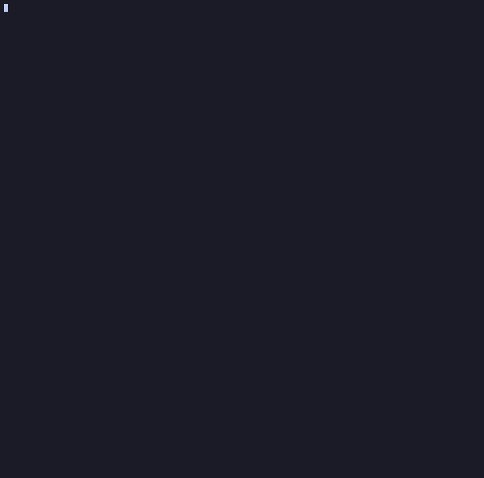
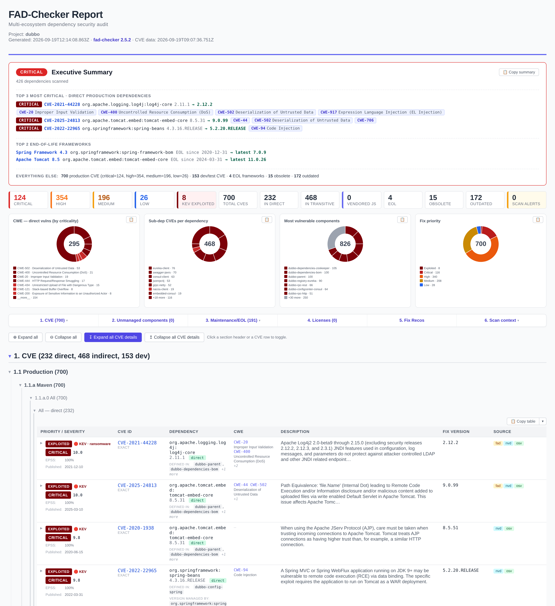

# fad-checker

[](https://www.npmjs.com/package/fad-checker)
[](https://www.npmjs.com/package/fad-checker)
[](LICENSE)
[](https://nodejs.org)
[](https://github.com/9pings/fad-checker/actions/workflows/ci.yml)

> **F**ormidable **A**uditor's **D**ependency **C**hecker<br>
> AKA **F**uckin' **A**utonomous **D**ependency **C**hecker<br>

`fad-checker` audits **Maven · Gradle · npm · Yarn · pnpm · Composer · PyPI · NuGet · Go · Ruby**, vendored JavaScript, committed native binaries and cryptographic material (certificates & private/public keys) in any source tree; multi-module, monorepo, polyglot; and produces a self-contained **HTML + Word report** (CVE prioritised by EPSS + CISA KEV, EOL, obsolete, outdated, licenses) plus **CycloneDX SBOM / CSAF VEX / SARIF / JSON** exports. **No build tools, no Docker, no network needed**; it reads lockfiles and manifests straight off disk.

🌐 **[Project site & docs →](https://9pings.github.io/fad-checker/)**

> [!WARNING]
> fad-checker is new and may still contain ( rare ) bugs. Treat its output as a strong first pass, **double-check anything critical**, and please [report issues](https://github.com/9pings/fad-checker/issues); they get fixed fast.

<p align="center"></p>

## Features

- **10 ecosystems in one pass**; Maven, Gradle, npm/Yarn/pnpm, Composer, PyPI, NuGet, Go, Ruby — plus **vendored JS**, committed **native binaries** (identified by checksum) and **embedded JARs** (fat-jars/war/ear, opened in-memory).
- **No build tools**; manifests and lockfiles are read off disk. No `mvn`/`gradle`/`npm install`/`pip`/`dotnet restore`/`go build`, no `node_modules/`. The Maven graph is resolved the way Maven resolves it. → [how](docs/COMPARISON.md#how-its-autonomous-no-build-tools)
- **CVE, merged & prioritised**; CVEProject + OSV.dev + NVD, CPE/version cross-checked to cut false positives, ranked **CISA KEV → EPSS → CVSS**.
- **Beyond CVEs**; EOL and out-of-active-support frameworks, deprecated/abandoned/yanked, outdated with release dates, SPDX **licenses**, and **private/internal packages** — every coordinate no configured registry knows, in any ecosystem.
- **Crypto material**; committed **certificates** (expiry, weak key, weak signature, self-signed), **private vs public keys** across PEM/OpenSSH/PuTTY/PGP and JKS/PKCS#12 keystores. Parsed offline, no network.
- **Air-gapped**; **zero network under `--offline`**, regression-tested and reproducible under `unshare -rn`. On Maven it recovers **657/657** of OSV-Scanner's *online* result with no network interface at all, against 45 / 40 / 37 for the others. → [Benchmark](docs/BENCHMARK.md) · [Air-gapped](#air-gapped-audits)
- **Supply-chain risk**; known-**malicious** advisories (always block the CI gate) and suspected **typosquats** (`--typosquat`).
- **Audit-grade**; every report carries a **provenance manifest** and a **Methodology & limitations** chapter; artifacts ship `SHA256SUMS`; **differential audits** diff against a prior run (`--baseline`) and CI can gate on *new* findings only.
- **Outputs & CI**; HTML + Word `.doc`, CycloneDX 1.6 SBOM, CSAF 2.0 VEX, SARIF 2.1.0, JSON; gate with `--fail-on`, triage with `--ignore`/`--vex`. Private registries for every ecosystem.

📖 **[Usage & all flags](docs/USAGE.md)** · **[Architecture](docs/ARCHITECTURE.md)** · **[Comparison vs other tools](docs/COMPARISON.md)** · **[Data sources](docs/DATA-SOURCES.md)**

## Why use fad-checker for code audits?

What it does for an audit that the others don't. Same column set and sourcing discipline as
[`docs/COMPARISON.md`](docs/COMPARISON.md) — `⚠️` is *partial* and says how, cells are meant to be
checkable.

| What an auditor actually needs to do                                                       | **fad** | OSV | Trivy | Grype+Syft | OWASP DC | Snyk |
| ------------------------------------------------------------------------------------------ | :-: | :-: | :-: | :-: | :-: | :-: |
| Audit a **100-module polyglot monorepo in one command**, with **no toolchain installed** ¹ | ✅ 105 modules | ⚠️ reactor skipped | ⚠️ needs `~/.m2` | ⚠️ opt-in | ⚠️ Java build | ⚠️ `mvn` build |
| **Scan offline / air-gapped without dropping transitive deps** ²                           | ✅ 657/657 | ❌ | ⚠️ `~/.m2` | ⚠️ opt-in | ⚠️ mirror | ❌ |
| **Identify the private/internal deps** across a big project ³                              | ✅ | ❌ | ❌ | ❌ | ❌ | ❌ |
| **Extract cleaned deps descriptors** into an external directory ⁴                          | ✅ `-t` | ❌ | ❌ | ❌ | ❌ | ❌ |
| **Report EOL / deprecated frameworks & deps**, transitive ones included ⁵                  | ✅ | ⚠️ deprecated only | ⚠️ OS distros only | ❌ | ❌ | ⚠️ web UI only |
| **Report committed keys & certificates** ⁶                                                 | ✅ | ❌ | ⚠️ key rule | ❌ | ❌ | ❌ |
| **Spot committed binaries** (`.dll`, `.exe`, …) and check them against their checksums ⁷   | ✅ | ❌ | ⚠️ some | ⚠️ patterns | ❌ | ❌ |
| **Clearly list what was *not* scanned** — before the client asks ⁸                         | ✅ ch. 0 + 6.3 | ⚠️ log | ⚠️ log | ⚠️ log | ⚠️ log | ⚠️ log |
| **Answer "against what data?" six months later** ⁹                                         | ✅ | ❌ | ❌ | ⚠️ DB date | ⚠️ NVD date | ❌ |
| **Send a report, not a JSON dump** ¹⁰                                                      | ✅ HTML + `.doc` | ⚠️ HTML list | ⚠️ template | ❌ | ⚠️ HTML list | ⚠️ `snyk-to-html` |
| **Charts, per-CVE drill-down and a pasteable Word copy** ¹¹                                | ✅ | ❌ | ❌ | ❌ | ❌ | ❌ |
| **Make delta reports showing only what changed** ¹²                                        | ✅ `--baseline` | ❌ | ❌ | ❌ | ❌ | ⚠️ cloud |

¹ No `mvn`/`go`/`npm`/`pip`/`dotnet` — manifests parsed off disk, nothing installed or executed. 105 × `pom.xml` in one pass: **790 pairs vs OSV-Scanner's 657**, 133 fad-only, versions mediated *per module* not flattened.

² **657 of 657** of OSV-Scanner's *online* Maven result, under `unshare -rn` — no network interface. Tripwire-tested; only public coordinates ever leave the enclave.

³ Chapter 0 names every coordinate that **every** configured registry answered 404 for — Maven, npm, PyPI, NuGet, Composer, Go and RubyGems — with the manifest(s) declaring it. A registry that timed out or errored is never counted: an inconclusive answer would otherwise accuse a client of shipping internal packages because their proxy was flaky. `-e <regex>` then excludes them.

⁴ `-t <dir>`: normalised POMs plus every non-Maven lockfile mirrored, private coordinates stripped. Archivable, and scannable by anything — `--snyk` included.

⁵ endoflife.date, split **direct vs transitive** so you know which dep to bump, plus deprecated / abandoned / yanked and outdated. Trivy covers OS distros only; Snyk's package health is web-only.

⁶ Inventory *and* verdicts: expiry, RSA<2048, MD5/SHA1, self-signed; private **vs** public keys; JKS/PKCS#12. Offline parser. Trivy's secret rule finds the file, not the flaw.

⁷ Identified by **hash** via deps.dev + CIRCL → should-be-declared / name≠checksum / unknown / malicious. Syft's patterns name a version, not an identity.

⁸ Chapter 0 flags what *this* scan couldn't reach (missing lockfiles, BOM-only versions, Yarn Berry, undeterminable PHP runtime); chapter 6.3 states what the tool never assesses. Elsewhere the first is a log line the audit never sees, the second isn't written down.

⁹ Provenance manifest: tool, runtime, mode, run configuration and cache freshness for **all 13 sources**. Grype and Dependency-Check carry one source's date, not the run.

¹⁰ Chapters 0→6 with an executive summary and fix recipes, self-contained HTML plus a Word `.doc` twin. None of the others emits Word.

¹¹ Four inline-SVG charts — CWE by worst severity, vulnerable transitives per root dep, direct vs transitive, fix-priority bands — rendered in the `.doc` too, with one-click copy as PNG (or a table as rich HTML) that pastes into Word formatted. Every CVE keeps its CVSS vector, CWE, references, CPE config and via-path behind a drill-down, with zero external assets.

¹² `--baseline` adds a Δ chapter (new / fixed / unchanged); `--fail-on-new` gates on new findings only. Snyk tracks this on its platform, not as a local diff.

**Where it loses** — containers/OS packages, auto-fix PRs, and CVE coverage against Snyk's curated
feed → [`docs/COMPARISON.md`](docs/COMPARISON.md) ·
[the gap, measured](#coverage-honestly-the-pairs-snyk-reports-and-fad-checker-doesnt).

**Deliberately not a goal: reachability.** A finding is a vulnerable version on the dependency
graph, and the report says exactly that (ch. 6.3) instead of guessing at call paths. Deciding
whether the vulnerable code is reachable in *this* application is the auditor's call, made with
application context no scanner has.

## Quick start

```bash
npm install -g fad-checker
fad-checker -s ./my-project          # → ./fad-checker-report/cve-report.html
```

A free [NVD API key](https://nvd.nist.gov/developers/request-an-api-key) (instant) gives 10× faster enrichment: `fad-checker --set-nvd-key YOUR_KEY`. A few common runs; full list via `fad-checker --help` or [docs/USAGE.md](docs/USAGE.md):

```bash
fad-checker -s ./proj -e "^com\.acme\."                        # exclude private libs (coord regex)
fad-checker -s ./proj -t ../clean -e "^com\.acme\."            # extract only: normalised descriptors, private modules flagged
fad-checker -s ./proj -t ../clean -e "^com\.acme\." --snyk     # same extraction + scan + merge Snyk
fad-checker -s ./proj --offline                                # fully offline (zero network, needs a warmed cache)
fad-checker -s ./proj --osv-db --typosquat                     # offline-complete OSV + typosquat
fad-checker -s ./proj --licenses --fail-on high                # license chapter + CI gate
fad-checker -s ./proj --report-json --baseline last.json --fail-on-new   # differential audit: fail CI on NEW findings
fad-checker diff last.json this.json                           # standalone diff of two findings JSONs
```

**What `-t <dir>` actually does.** It is an **extraction** step, not a Snyk adapter. It writes a
parallel tree of **normalised dependency descriptors**: every `pom.xml` reduced to the
dependency-relevant nodes (coordinates, `properties`, `dependencyManagement`, `dependencies`,
`modules`), reactor parents rewired to their real in-tree `relativePath`, `${…}` resolved in
coordinates — **plus every non-Maven lockfile/manifest mirrored** at the same relative path
(`package-lock`/`yarn.lock`/`pnpm-lock`, `composer.lock`, `poetry`/`Pipfile`/`uv`/`pdm`,
`*.csproj`/`packages.lock.json`, `go.mod`/`go.sum`, `Gemfile.lock`, and companions like
`Directory.Packages.props` or `nuget.config`). Online it also **probes every coordinate against
the configured Maven repositories** and reports the ones that don't exist there — your
**private/internal modules** — which `-e <regex>` then strips from the rewritten POMs. Then it
**stops**: no CVE/EOL pass and no report unless you also pass `--snyk`, a `--report-<type>`,
`--fail-on*` or `--baseline`. What you get is a buildless, sanitised dependency inventory you can
archive as audit evidence, hand to a client or a legal review, or point any scanner at — Snyk via
`--snyk` being one of them.

> [!IMPORTANT]
> **`--offline` reads the cache, it doesn't replace it.** On a *cold* cache there is nothing to
> match against, so an offline first run legitimately reports **0 CVE / 0 EOL / 0 outdated**;
> that's an empty cache, not a clean project. Warm it once (a normal online run on any project,
> or `--import-cache`), then `--offline` returns the full result set with zero network calls.
> Air-gapped machines get their cache via [`--export-cache` / `--import-cache`](#air-gapped-audits).

A single self-contained binary (no Node), from-source install and shell completion are in → [docs/USAGE.md](docs/USAGE.md).

## What it finds

The report is organised into **root chapters** (each grouping related sub-chapters):

| Chapter | Source | What it catches |
| --- | --- | --- |
| **0. Warnings** *(top)* | local heuristics | Missing lockfiles, unresolved Maven versions (BOM-managed), private libs not on Maven Central |
| **Δ. Changes since baseline** *(top, with `--baseline`)* | diff vs prior JSON | New / fixed / unchanged findings per category + the list of **new production CVEs**; for repeat audits and `--fail-on-new` CI gating |
| **1. CVE** *(X direct, Y indirect, Z dev)* | CVEProject + OSV.dev + NVD + CPE | **1.1 Production**; public CVE / GHSA in prod deps, per ecosystem, per manifest, **prioritised** by CISA KEV + EPSS + CVSS · **1.2 Vendored JS vulns** ([retire.js](https://retirejs.github.io/)) · **1.3 Dev** (`test`/`provided`, `dev`/`optional`/`peer`) · **1.4 Likely false positives** (CPE-filtered) |
| **2. Unmanaged / unversioned components** | deps.dev + CIRCL (by checksum), retire.js, built-in X.509 | **2.1 Embedded binaries**; CVEs in libs shipped inside committed `.jar`/`.war`/`.ear` (fat-jars, shaded uber-jars) · **2.2 Native binaries** (`.dll`/`.exe`/`.so`/`.dylib`) identified by hash, flagged should-be-managed / name≠checksum / unknown / malicious · **2.3 Vendored JavaScript** inventory (jQuery, Bootstrap, …) vulnerable *or not* · **2.4 Certificates &amp; key material**; committed certs (expiry / weak key / weak signature / self-signed), **private vs public keys** (PEM/OpenSSH/PuTTY/PGP/SSH) and keystores, all parsed offline |
| **3. Maintenance / lifecycle** *(X EOL, Y obsolete, Z outdated)* | endoflife.date · curated + registry flags · Maven Central / npm / Packagist / PyPI / NuGet | **3.1 End-of-Life** frameworks (+ an "Out of active support" band with `--eol-support`; Symfony/Laravel grouped as one row per framework; PHP runtime when the Composer constraint proves it), split **direct** (declared / parent-POM-inherited — bump these) vs **transitive** (bump the dep that pulls them in) · **3.2 Obsolete / deprecated / abandoned / yanked** · **3.3 Outdated** (newer version available, with release dates; direct deps only) |
| **4. Licenses** *(opt-in: `--licenses`)* | registry metadata + Maven POMs → SPDX policy | Each dep's license normalised to SPDX and classified; copyleft (GPL/AGPL/LGPL/MPL), proprietary and unknown flagged for review |
| **5. Fix Recommendations** | computed | Per-ecosystem pin recipes: Maven `<dependencyManagement>`, Gradle `constraints { }`, npm `overrides`, yarn `resolutions`, `composer require`, `pip install`, `dotnet add package` |
| **6. Scan context & limitations** | provenance manifest + walk | **6.1 Scanned descriptors** (every manifest parsed) · **6.2 Ignored directories** (pruned paths + rule) · **6.3 Methodology, data sources & limitations** (data-source freshness, run config, explicit statement of **what fad-checker does *not* assess**) |
| **Supply-chain risk** *(cross-cutting)* | OSV `MAL-…` + name heuristic | **Known-malicious** packages (always block the CI gate, any `--fail-on` level) and **suspected typosquats** (`--typosquat`: an npm/PyPI name one edit from a popular package; `lodahs`↔`lodash`) |

The HTML report opens in any browser, contains every detail (CVSS vectors, references, full descriptions, CPE configurations, via-paths for transitives) and ships a Word-compatible `.doc` twin. Every match carries a **composite priority** (KEV-exploited > EPSS likelihood > CVSS severity), and the run can additionally emit a **CycloneDX 1.6 SBOM** (`--report-sbom`, vulnerabilities inline) and a **CSAF 2.0 VEX** (`--report-csaf`) for downstream tooling.

<p align="center"></p>

## Coverage, honestly: the pairs Snyk reports and fad-checker doesn't

No tool finds everything. fad-checker leads at **87% of a 908-pair union**, and **131 pairs came
back from Snyk and not from it**. Adjudicated one by one against OSV, **none is a recall bug**:

| | Verdict |
| ---: | --- |
| 57 | wrong artifact — the advisory binds a different coordinate |
| 31 | out of range — the version is outside every declared affected range |
| 23 | not in OSV — 19 proprietary `SNYK-*` ids, 4 that only NVD carries |
| 19 | no Maven binding — the advisory binds no Maven package at all |
| 1 | already reported, under the CVE alias |
| **0** | **confirmed miss** |

**Two thirds contradict the public record**, so reporting them would mean shipping false
positives. `CVE-2023-6481` is the clean example: claimed on `logback-classic@1.2.2`, it binds
`logback-core` at `[1.2.12, 1.2.13)` — wrong artifact, and a version published before the flaw
existed.

**Scope.** All 131 are Snyk's: OSV-Scanner, Trivy and Grype+Syft each contributed **0** findings
no one else had. And all are on the Maven target — outside Maven the graph is in the lockfile,
every scanner reads the same input, and the benchmark measures identical finding sets on npm,
RubyGems and Composer.

**Which is why `--snyk` exists.** fad-checker takes `snyk test` output as an **input** and merges
it, so you get the union rather than picking a side. A coverage choice, not a correction.

Method, caveats and the per-pair verdicts → [`docs/BENCHMARK.md`](docs/BENCHMARK.md); reproduce
with [`scripts/adjudicate-gap.js`](scripts/adjudicate-gap.js).

## Air-gapped audits

> **Zero-data-sent guarantee.** Under `--offline`, fad-checker makes **no network calls
> whatsoever**; it reads only the warmed `~/.fad-checker/` caches and never transmits a
> dependency, path or finding off the machine. It is regression-tested
> (`test/offline-guarantee.test.js`, a tripwire fetcher that throws if touched) and
> auditor-reproducible: `unshare -rn node fad-checker.js -s ./proj --offline …` runs it in a
> namespace with **no network interface** and yields byte-identical findings. Unlike the
> mainstream OSS scanners, fad also resolves the **Maven transitive graph** offline; so on
> an air-gapped multi-module project it finds the transitive CVEs they can't.

When the audited system is **offline / confidential** (typical of a regulated or air-gapped audit) it
can't reach OSV / NVD / Maven Central / npm. Split the work across machines while keeping
**zero environment information** off the secure enclave: an anonymized descriptor carries
only **public package coordinates**; no filesystem paths, no registry URLs, no
hostnames/usernames; and the **detailed report is produced back on the offline machine**.

The transfer relies on a property of fad-checker's caches: they are keyed by *coordinate*
or *vuln id*, never by path, so they are **machine-independent**. The online step just
**warms the caches**; the offline step replays the scan and gets cache hits.

```bash
# ── Phase 1; OFFLINE (audited machine): export the anonymized descriptor ──
# Exclude private/internal packages with -e (offline we can't tell private from public).
fad-checker -s ./proj -e "^(client|internal)\." --export-anonymized deps.json
#   → deps.json: public coordinates only. Review it before it leaves the enclave.

# ── Phase 2; ONLINE (any machine, no source needed): warm the caches ──
fad-checker --import-anonymized deps.json     # scans coordinates → OSV/NVD/CVE/registry/EOL + retire signatures
fad-checker --export-cache fad-cache.tar.gz   # bundle the warmed ~/.fad-checker/

# ── Phase 3; OFFLINE (audited machine): full report, all local context ──
fad-checker --import-cache fad-cache.tar.gz   # merged into the enclave's own cache
fad-checker -s ./proj --offline               # re-collect locally (real paths) + cache hits
#   → full HTML/.doc report with manifests & structure, generated inside the enclave.
```

What the descriptor (`fad-deps/1`) contains vs. drops:

| Kept (needed to scan) | Dropped (environment) |
| --- | --- |
| ecosystem, ecosystemType | manifest paths / pom paths |
| namespace, name | resolved registry URLs |
| version, versions | integrity hashes |
| scope, isDev | parent chains, lockfile type |

The online phase report is itself path-free; vendored-JavaScript (retire.js) findings are
produced **offline in phase 3**, since retire needs the actual `.js` files; its signature
DB is warmed online (phase 2) and carried by `--export-cache`. Full offline/cache control →
[`docs/USAGE.md`](docs/USAGE.md).

## Docs

- [`docs/USAGE.md`](docs/USAGE.md); every flag and workflow: offline/cache control, private registries, config files, recipes, safety rails.
- [`docs/ARCHITECTURE.md`](docs/ARCHITECTURE.md); internals: codecs, collection, matching, report pipeline.
- [`docs/COMPARISON.md`](docs/COMPARISON.md); vs OSV-Scanner / Trivy / Grype / OWASP DC / Snyk, and how it stays build-free.
- [`docs/BENCHMARK.md`](docs/BENCHMARK.md) — reproducible air-gapped recall benchmark vs OSV-Scanner on a public 105-module project.
- [`docs/DATA-SOURCES.md`](docs/DATA-SOURCES.md); the public datasets fad-checker uses + their licenses.
- [`docs/SPEC-audit-pro.md`](docs/SPEC-audit-pro.md); the audit-grade features (provenance, differential audit, methodology/integrity) and why each was built that way.
- [`CHANGELOG.md`](CHANGELOG.md) · [`CLAUDE.md`](CLAUDE.md); release history · code-level orientation for contributors.

## Contributing

The most useful contribution to a young scanner is **telling it where it's wrong**: run it on a
real project and file a [false positive / false negative report](https://github.com/9pings/fad-checker/issues/new?template=false_positive.yml)
with the coordinate and the manifest snippet that produced it. Dev setup, ground rules and the
codec extension point → [`CONTRIBUTING.md`](CONTRIBUTING.md). Vulnerabilities in fad-checker
itself → [`SECURITY.md`](SECURITY.md) (please report privately).

**On AI assistance:** this codebase is written with heavy use of Claude Code; [`CLAUDE.md`](CLAUDE.md)
in the repo root is exactly what it looks like. The bar it's held to is the one you can check
yourself: **642 tests** (`npm test`), the zero-network guarantee enforced by a tripwire test and
reproducible under `unshare -rn`, and coverage numbers measured against a Snyk baseline rather
than asserted. `fad-checker` itself uses **no LLM at runtime**; findings come from public
vulnerability databases and deterministic parsers, and no report text is generated. Full
statement, including where review actually caught a bad finding →
[`AI_POLICY.md`](AI_POLICY.md). Where the code doesn't meet that bar, that's a bug report I want.

## License

MIT; see [`LICENSE`](LICENSE).
